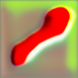
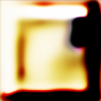
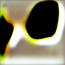
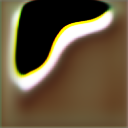
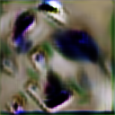
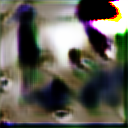
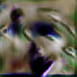

# Генерация изображений животных с помощью GAN архитектуры

В качестве темы для обучения хотел изначально взять генерацию звука, но во время обучения, так и не получилось получить
что-то большее чем просто шум, скорее всего выбрал слишком сложные данные, а если брать простые, то они сами очень
похожи на шум.

## Данные

Решил выбрать обучение простого конволюционного GAN для генерации фото изображений собак. В распоряжении было две T4,
поэтому пробовал обучать модель на разном количестве изображений, дошел до 4000 фото. Брал данные с kaggle по этой
ссылке: https://www.kaggle.com/datasets/andrewmvd/animal-faces

## Архитектура

Размерность изображений выбрал $128 \times 128 \times 3$ , с размером латентного пространства эксперементами с запуском
дошел до $1024$. В генераторе варьировал количество блоков следующего вида: $UpSample, Conv2d, BatchNorm2d, ReLu$ и
постепенно уменьшал количество каналов с $512$ до $3$.

## Структура проекта

`train.py` - файл тренировки модели

`generator.py` - файл с архитектурой генератора

`disriminator.py` - файл с архитекторой дискриминатора

## Результаты

К сожалению, не получилось обучить модель генерации фото собак, модель обучается, но получается только что-то отдалённо
похожее на данные из датасета.

После 10 эпох:

После 300 эпох:

